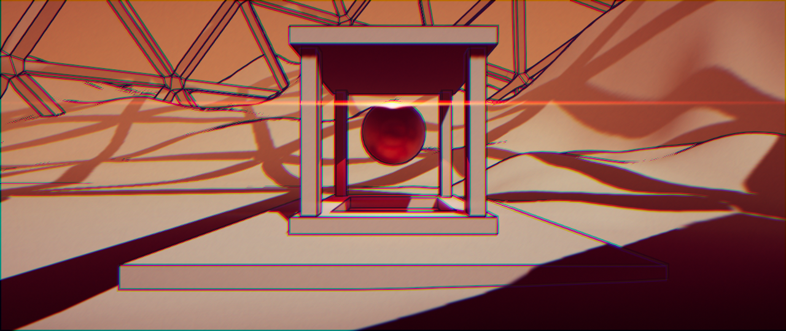
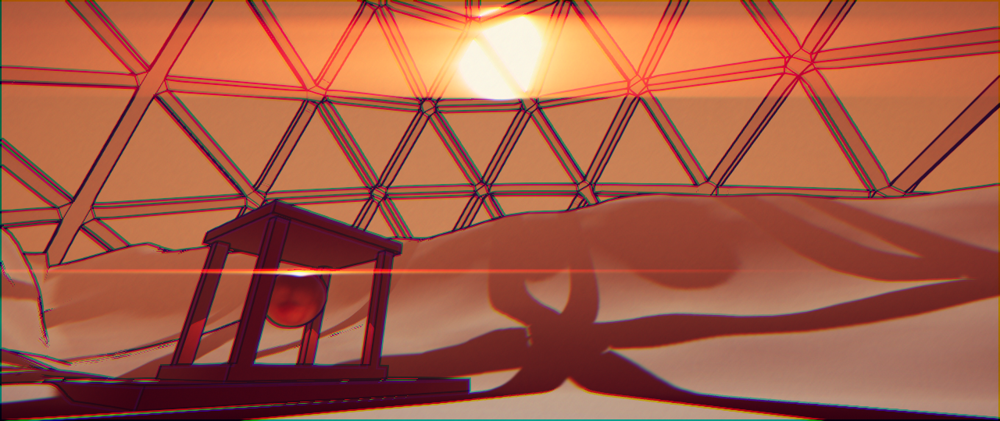
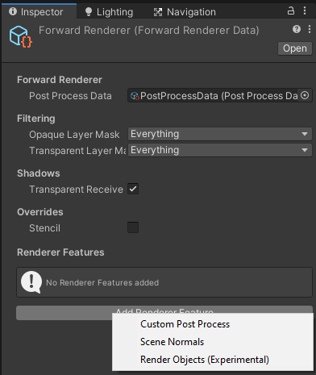
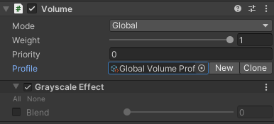
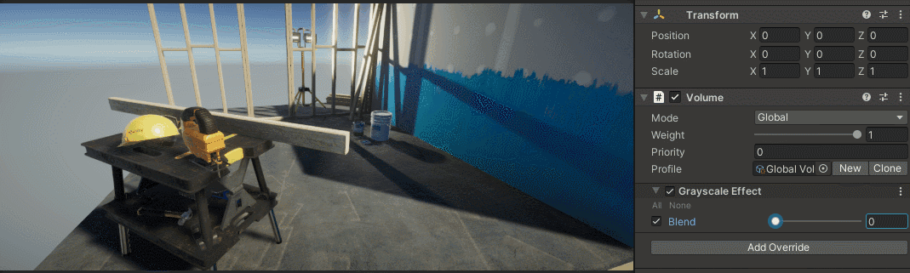

# Customizable Post-processing Stack for Universal Render Pipeline

This package adds the ability to create custom post-processing effects for the universal render pipeline in a manner similar to [PPSv2](https://github.com/Unity-Technologies/PostProcessing) and [HDRP's Custom Post Process](https://docs.unity3d.com/Packages/com.unity.render-pipelines.high-definition@8.2/manual/Custom-Post-Process.html). It is supposed to be a replacement for Unity's **PPSv2** till URP internally supports custom post-processing effects.

**Note:** You can already add you custom effects to URP by inheriting from the `ScriptableRendererFeature` and `ScriptableRenderPass` classes. I personally find this to be a hassle and that is why I wrote this package merely for convenience. I also took it as a chance to pick up the features I like from every post-processing solution I used in Unity.

## Screenshots




The screenshots uses the following builtin effects:
* Tonemapping
* Vignette
* Film Grain
* Split Toning

For the custom effects, they contain the following:
* Edge Detection (Adapted from [this tutorial](https://halisavakis.com/my-take-on-shaders-edge-detection-image-effect/) by [Harry Alisavakis](https://halisavakis.com/)).
* Gradient Fog.
* Chromatic Splitting.
* Streak (Adapted from [Kino](https://github.com/keijiro/Kino) by [Keijiro Takahashi](https://github.com/keijiro)).

Other custom effects in samples but not used in screenshots:
* After Image.
* Glitch.
* Grayscale.
* Invert.

## Compatibility

* Unity 2020.2
* URP 10.2.2

**Note:** There is a branch with support for URP 8.2.0 (Unity 2020.1) which you can find [here](https://github.com/yahiaetman/URPCustomPostProcessingStack/tree/URP-8.2.0).

## Features

* Conveniently add custom post processing effects à la [PPSv2](https://github.com/Unity-Technologies/PostProcessing) and [HDRP's Custom Post Process](https://docs.unity3d.com/Packages/com.unity.render-pipelines.high-definition@8.2/manual/Custom-Post-Process.html).
* Reorder effects from the editor like HDRP's [Custom Post Process Orders Settings](https://docs.unity3d.com/Packages/com.unity.render-pipelines.high-definition@8.2/manual/Custom-Post-Process.html#effect-ordering).
* Use legacy `Image Effect Shaders` and `Unlit Shader Graphs` if you wish. It worked out of the box; No work was done by me.
* Use it with `Camera Stacking`.

### Features that are almost untested:
* It should be compatible with **MultiPass XR** but it is tested with **Mock HMD Loader** only so I can't guarantee that it works on an actual headset.
* URP's `2D Renderer` doesn't support renderer features yet. However, you can use camera stacking to stack a `Forward Renderer` camera on top of the `2D Renderer` camera and apply the post processing to the `2D Renderer` output. I tried it and it worked but I didn't heavily test it yet.

## Known Issues

* It failed with **Single-Pass Instanced** on **Mock HMD Loader**.

## Features I hope to implement

- [ ] Global settings for `CustomPostProcessRenderer` to be set from the renderer feature instead of the volume component.
- [ ] A Volumetric Light Effect as a sample.
- [ ] The ability to add the same renderer multiple times under the same injection point (not sure yet if it is a good idea).

## How To Install

Follow the instructions from the Unity manual on [Installing from a Git URL](https://docs.unity3d.com/Manual/upm-ui-giturl.html) and insert the url:
> https://github.com/yahiaetman/URPCustomPostProcessingStack.git

The package also contains 8 example effects included as a sample.

## Tutorial

For the sake of simplicity, we will create a grayscale effect.

### Effect Renderer and Volume Component Script

First, lets create two C# classes. Create a script called `GrayscaleEffect.cs` and in the script, write the following:

```csharp
using UnityEngine;
using UnityEngine.Rendering;
using UnityEngine.Rendering.Universal;
using UnityEngine.Rendering.Universal.PostProcessing;

// Define the Volume Component for the custom post processing effect 
[System.Serializable, VolumeComponentMenu("CustomPostProcess/Grayscale")]
public class GrayscaleEffect : VolumeComponent
{
    [Tooltip("Controls the blending between the original and the grayscale color.")]
    public ClampedFloatParameter blend = new ClampedFloatParameter(0, 0, 1);
}

// Define the renderer for the custom post processing effect
[CustomPostProcess("Grayscale", CustomPostProcessInjectionPoint.AfterPostProcess)]
public class GrayscaleEffectRenderer : CustomPostProcessRenderer
{
    // A variable to hold a reference to the corresponding volume component
    private GrayscaleEffect m_VolumeComponent;

    // The postprocessing material
    private Material m_Material;
    
    // The ids of the shader variables
    static class ShaderIDs {
        internal readonly static int Input = Shader.PropertyToID("_MainTex");
        internal readonly static int Blend = Shader.PropertyToID("_Blend");
    }
    
    // By default, the effect is visible in the scene view, but we can change that here.
    public override bool visibleInSceneView => true;

    /// Specifies the input needed by this custom post process. Default is Color only.
    public override ScriptableRenderPassInput input => ScriptableRenderPassInput.Color;
    
    // Initialized is called only once before the first render call
    // so we use it to create our material
    public override void Initialize()
    {
        m_Material = CoreUtils.CreateEngineMaterial("Hidden/PostProcess/Grayscale");
    }

    // Called for each camera/injection point pair on each frame. Return true if the effect should be rendered for this camera.
    public override bool Setup(ref RenderingData renderingData, CustomPostProcessInjectionPoint injectionPoint)
    {
        // Get the current volume stack
        var stack = VolumeManager.instance.stack;
        // Get the corresponding volume component
        m_VolumeComponent = stack.GetComponent<GrayscaleEffect>();
        // if blend value > 0, then we need to render this effect. 
        return m_VolumeComponent.blend.value > 0;
    }

    // The actual rendering execution is done here
    public override void Render(CommandBuffer cmd, RenderTargetIdentifier source, RenderTargetIdentifier destination, ref RenderingData renderingData, CustomPostProcessInjectionPoint injectionPoint)
    {
        // set material properties
        if(m_Material != null){
            m_Material.SetFloat(ShaderIDs.Blend, m_VolumeComponent.blend.value);
        }
        // set source texture
        cmd.SetGlobalTexture(ShaderIDs.Input, source);
        // draw a fullscreen triangle to the destination
        CoreUtils.DrawFullScreen(cmd, m_Material, destination);
    }
}
```

As you can see, the code consists of two classes: **a volume component** and **a renderer**.
* The volume component only holds data and will appear as a volume profile option.
* The renderer is rensponsible for rendering the effect and reads the effect parameters from the volume component.

The name of the file must match the **Volume Vomponent** class name to comply with Unity's serialization rules.

**NOTE:** The renderer must be tagged by a `CustomPostProcessAttribute` to be taken consideration by the custom post-process renderer feature. The attribute has the following parameters:
* **Name**: It is displayed in the custom post-process renderer feature editor and the frame debugger.
* **Injection Point**: It determines the passes in which the renderer will be injected. Note that you can define multiple injection locations for the same renderer. For example `CustomPostProcessInjectionPoint.AfterPostProcess | CustomPostProcessInjectionPoint.BeforePostProcess` means that the render can be injected before or after the builtin post processing (or at both injection points).
* **Share Instance** [optional, default: `false`]: If the renderer will be injected at multiple points, this parameter determines whether to create a separate instance for each injection point (value: `false`) or to share a single instance between them (value: `true`).

#### Design notes

**Volume components** and **Renderers** are decoupled from each other which presents many possibilities while implementing your effects. For example:
1. You can have a one-to-one relationship between your volume component and your renderer (as we did above).
2. You can have a renderer without any corresponding volume components if it does not need any data from the volumes.
3. You can have a renderer that reads from multiple volume components (see [GrayAndInvertEffect.cs](Samples~/Examples/Scripts/PostProcessing/GrayAndInvertEffect.cs) as an example).
4. You can have multiple renderers read from the same volume component(s).

Option #3 is especially useful for writing uber effect shaders that can do multiple effects in the same blit to enhance performance.

### Effect Shader

Now back to coding. We need to write the shader code. Create a shader file with any name you like (I prefer `Grayscale.shader`) and replace its content with the following code:

```glsl
Shader "Hidden/PostProcess/Grayscale"
{
    HLSLINCLUDE
    #include "Packages/com.yetman.render-pipelines.universal.postprocess/ShaderLibrary/Core.hlsl"
    #include "Packages/com.unity.render-pipelines.core/ShaderLibrary/Color.hlsl"

    TEXTURE2D_X(_MainTex);

    float _Blend;

    float4 GrayscaleFragmentProgram (PostProcessVaryings input) : SV_Target
    {
        UNITY_SETUP_STEREO_EYE_INDEX_POST_VERTEX(input);

        float2 uv = UnityStereoTransformScreenSpaceTex(input.texcoord);
        float4 color = LOAD_TEXTURE2D_X(_MainTex, uv * _ScreenSize.xy);
        
        // Blend between the original and the grayscale color
        color.rgb = lerp(color.rgb, Luminance(color.rgb).xxx, _Blend);
        
        return color;
    }
    ENDHLSL

    SubShader
    {
        Cull Off ZWrite Off ZTest Always
        Pass
        {
            HLSLPROGRAM
            #pragma vertex FullScreenTrianglePostProcessVertexProgram
            #pragma fragment GrayscaleFragmentProgram
            ENDHLSL
        }
    }
    Fallback Off
}
```

Since vertex shaders rarely contain any logic specific to the effect, we use a default vertex shader `FullScreenTrianglePostProcessVertexProgram` which is included in:
```
Packages/com.yetman.render-pipelines.universal.postprocess/ShaderLibrary/Core.hlsl
```
The fragment shader is where the magic happens. It reads the original pixel color, calculates the grayscale color and blends the two colors together.

### Editor Steps

Now that we have our custom effect, we need to add a `CustomPostProcess` renderer feature to the `ForwardRenderer` asset as seen in the next image. You can also add a `SceneNormals` renderer feature if you want to use scene normals in an effect (such as Edge Detection).



The `CustomPostProcess` renderer feature contains 3 lists that represent 3 injection points in the `ScriptableRenderer` as seen in the next image. The three injection points are:
* **After Opaque and Sky** where we can apply effects before the transparent geometry is rendered.
* **Before Post Process** which happens after the transparent geometry is rendered but before the builtin post processing is applied.
* **After Post Process** which happens at the very end before the result is blit to the camera target.

The effect order in the lists is the same order in which they are executed (from top to bottom). You can re-order the effects as you see fit.

**Note**: Any effect must be added to the renderer feature to be rendered, otherwise, it will be ignored. So we added `GrayScale` to its list `After Post Process` as seen in the next image.


Then create a volume in the scene (or use an existing volume) and add a `Grayscale Effect` volume component to its profile as seen in the next image.



Now you can override the `Blend` parameter and see the view becoming grayscale.



We didn't explain some stuff here but you can see more in the samples:
* Merge effects and read from more than one volume component (see [GrayAndInvertEffect.cs](Samples~/Examples/Scripts/PostProcessing/GrayAndInvertEffect.cs) and [GrayAndInvert.shader](Samples~/Examples/Resources/Shaders/PostProcessing/GrayAndInvert.shader)). 
* Create temporary render targets inside the renderer (see [StreakEffect.cs](Samples~/Examples/Scripts/PostProcessing/StreakEffect.cs)).
* Create persistent render targets inside the renderer (see [AfterImageEffect.cs](Samples~/Examples/Scripts/PostProcessing/AfterImageEffect.cs)).
* Use a shader graph `Unlit shader` to create a post processing effect (see [GlitchEffect.cs](Samples~/Examples/Scripts/PostProcessing/GlitchEffect.cs)).
* Use a renderer at multiple injection points (see [GradientFogEffect.cs](Samples~/Examples/Scripts/PostProcessing/GradientFogEffect.cs) and [GradientFog.shader](Samples~/Examples/Resources/Shaders/PostProcessing/GradientFog.shader)).
* Requesting Depth and/or Normal Textures for a post processing effect (see [GradientFogEffect.cs](Samples~/Examples/Scripts/PostProcessing/GradientFogEffect.cs) and [EdgeDetectionEffect.cs](Samples~/Examples/Scripts/PostProcessing/EdgeDetectionEffect.cs))

## Issues & Pull Requests

If you find any bugs, 
kindly [open an issue](https://github.com/yahiaetman/urp-custom-pps/issues/new/choose). I would be glad to catch as many bugs as possible before using it in a game. Thanks in advance :blush:.

If you have any feature requests, also [open an issue](https://github.com/yahiaetman/urp-custom-pps/issues/new/choose). Also, [Pull requests](https://github.com/yahiaetman/urp-custom-pps/compare) are very welcome.

I apologize in advance if I couldn't reply in a timely manner but I will do my best to reply as soon as I can. 

## Contact

If you would like to contact me, DM me on Twitter: [@yetmania](https://twitter.com/yetmania)

## License
 [MIT License](LICENSE.md)
